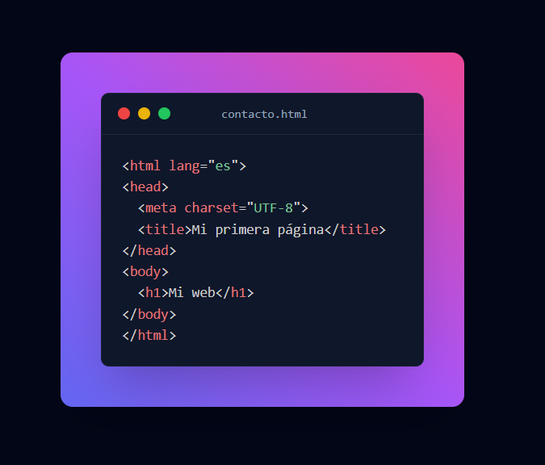

# 📸 SSCode

SSCode es una herramienta web para convertir fragmentos de código en capturas elegantes y listas para compartir. Está pensada para desarrolladores que quieren generar previews limpias, con estilo macOS y exportación directa en PNG.



---

## ✨ Características

- 🎨 Resaltado de sintaxis para HTML, CSS, JavaScript y Python
- 🌈 Selector de paletas de fondo con efecto visual en tiempo real
- 📏 Ajuste de padding y tamaño del marco
- 🖥️ Diseño estilo macOS con controles de ventana
- ⚡ Funcionamiento 100% frontend, sin backend ni almacenamiento externo
- 📤 Exportación en alta resolución como imagen PNG

---

## 🧩 Stack tecnológico

- HTML5
- CSS3
- JavaScript Vanilla
- Tailwind CSS via CDN
- Prism.js
- html-to-image

---

## 📁 Estructura del proyecto

```text
sscode/
├── index.html           # Interfaz principal
├── style.css            # Estilos y diseño visual
├── app.js               # Lógica de la aplicación
├── README.md            # Documentación del proyecto
├── img/
│   ├── favicon.svg      # Ícono del navegador
│   └── preview.png      # Vista previa del proyecto
├── .git/                # Metadatos del repositorio
└── .gitignore           # Archivos ignorados por Git
```

---

## 🚀 Cómo usarlo

1. Abre `index.html` en tu navegador.
2. Escribe o pega tu código en el editor.
3. Ajusta el tema, el padding y el estilo del frame.
4. Haz clic en el botón de descarga para guardar la imagen PNG.

---

## 📝 Nota

Este proyecto está pensado para ejecutarse sin servidor, por lo que solo requiere abrir el archivo HTML en un navegador moderno.
